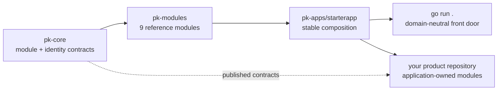

# PlatformKit

**A runnable, open-source Go foundation for multi-tenant SaaS.** Clone it, run
one command, and get tenant isolation, users, authentication, API keys, audit,
content, notifications, health, and a real operator console in one process.

[](https://github.com/septagon-oss/platformkit/actions/workflows/go.yml)
[](https://github.com/septagon-oss/platformkit/actions/workflows/security.yml)
[](LICENSE)
[](https://go.dev/dl/)


## Run the stable starter

No clone required. `@latest` resolves the newest release through the Go module
proxy, so this command does not go stale:

```bash
go run github.com/septagon-oss/platformkit@latest
```

Clone instead when you want the source to read, extend, or verify:

```bash
git clone https://github.com/septagon-oss/platformkit
cd platformkit
go run .
```

On a fresh database the default is deliberately predictable: the nine-module
starter from `pk-apps`, SQLite, and a loopback-only listener.

```text
============================================================
 PlatformKit OSS
  listening:    http://127.0.0.1:8080
  admin UI:     http://127.0.0.1:8080/admin
  health:       http://127.0.0.1:8080/healthz
  OpenAPI:      http://127.0.0.1:8080/openapi/extensions.json
  local tenant: tenant_local
  local login:  operator@local.test / local-development-only
  modules:      9 composed (...)
============================================================
```

Open `http://127.0.0.1:8080/`. The public landing page explains the running
surface without leaking credentials. The terminal prints the development login;
`/admin` presents a responsive, scope-protected operator workspace with typed
forms, useful tables, lifecycle actions, empty/error states, and mobile
navigation.

The fresh-database local development bootstrap is:

- Tenant: `tenant_local`
- Email: `operator@local.test`
- Password: `local-development-only`

An upgraded database may retain previously released tenant and user IDs so
downstream module rows are not orphaned. Its startup banner prints the actual
tenant ID and resolved email to use; the visible labels and development
password are still neutralized.

Those credentials are for local development. A configured or non-development
deployment fails closed without `seed.admin_password`, never reasserts a changed
production password, and never prints that password. `PORT=8090 go run .`
changes the port while staying on loopback. Listening on a network interface
requires an explicit address such as
`PK_HTTP_ADDR=0.0.0.0:8080 go run .`.

## Use the API

Authentication resolves a server-owned tenant and subject. Built-in resources
require explicit `<resource>:read` or `<resource>:write` scopes; the seeded
administrator has full access. API keys cannot acquire interactive `admin` or
`console:access` capabilities.

```bash
# Use the exact values printed in this database's startup banner. These are the
# fresh-database defaults; an upgraded database can retain an older tenant ID.
TENANT_ID=tenant_local
ADMIN_EMAIL=operator@local.test
ADMIN_PASSWORD=local-development-only

# Log in. The response contains a session ID.
curl -s -X POST http://127.0.0.1:8080/api/v1/auth/sessions \
  -H 'Content-Type: application/json' \
  -d "{\"tenant_id\":\"$TENANT_ID\",\"email\":\"$ADMIN_EMAIL\",\"password\":\"$ADMIN_PASSWORD\"}"

# Send that ID as a bearer token.
curl -s http://127.0.0.1:8080/api/v1/tenants \
  -H 'Authorization: Bearer YOUR_SESSION_ID'
```

Useful runtime routes:

| Route | Purpose | Access |
|---|---|---|
| `/` | Product and runtime landing page | Public |
| `/admin` | Schema-aware operator console | `admin` + `console:access` |
| `/healthz`, `/live`, `/ready` | Health and orchestration probes | Public |
| `/metrics` | `expvar` process and module metrics | `metrics:read` or admin |
| `/openapi/extensions.json` | Validated OpenAPI 3.1 extension operations | Public |
| `/api/v1/tenants` | Read/update/delete the caller's tenant; provisioning is out of band | `tenants:read/write` or admin |
| `/api/v1/users` | User management | `users:read/write` or admin |
| `/api/v1/api-keys` | Scoped machine credentials | `api-keys:read/write` or admin |
| `/api/v1/audit-events` | Append-only audit query | `audit:read` or admin |
| `/api/v1/content` | Stored content and publish lifecycle | `content:read/write` or admin |
| `/api/v1/notifications` | Stored in-app notification records | `notifications:read/write` or admin |

All request bodies are capped at 1 MiB. Mutating JSON rejects unknown fields
and trailing values, malformed or negative pagination returns `400`, and API
key scopes must be built in or declared by an application module. Anonymous
mutations are rejected, tenant identity comes from the verified credential
rather than request JSON, and process metrics are not public.

The generic starter does not invent end-user presentation. Creating a
notification persists a user-scoped record for the API/operator surface; it
does not display a navbar bell, toast, email, SMS, or push message. Creating or
publishing content persists its lifecycle state; it does not create a public
page, template, or URL. Those delivery and rendering choices belong in the
downstream application. See the
[current runtime boundaries](https://github.com/septagon-oss/pk-docs/blob/main/docs/current/runtime-surfaces.md).

## Build your product on top

This repository stays deliberately domain-neutral. Product-specific modules
belong in your application repository, where they can be changed or replaced
without forking PlatformKit.

The supported `starterapp.WithModules` seam composes application-owned modules
into the same SQLite pool, module catalog, identity perimeter, admin and health
registrars, request limits, and OpenAPI discovery as the built-ins:

```go
err := starterapp.Run(
    ctx,
    starterapp.DefaultConfig(),
    starterapp.WithModules(yourModule),
)
```

Start with the generic
[`pk-apps/reference/custommodule`](https://github.com/septagon-oss/pk-apps/tree/main/reference/custommodule)
reference, then keep your domain model, migrations, routes, and policies in the
repository that owns the product. The foundation remains reusable whether the
result is a CRM, marketplace, internal tool, booking system, or another SaaS.
The reference declares application API-key scopes, enforces them on every
route, uses append-only embedded migrations, derives identity from the
authenticated principal, and tests tenant isolation and strict inputs.

When you need to see the seam carry a full domain rather than a minimal one,
[`pk-apps/reference/polls`](https://github.com/septagon-oss/pk-apps/tree/main/reference/polls)
adds a lifecycle, an audit outbox committed atomically with each mutation,
signed anonymous voter identity, per-network throttling, `/metrics` counters,
and a public browser surface beside the JSON API.

## What is included

- **Tenants** — isolation in stores and request identity.
- **Users** — tenant-scoped records and password lifecycle.
- **Authentication** — browser sessions and bearer-session support.
- **API keys** — one-time plaintext display and explicit machine scopes.
- **Audit** — append-only operational events.
- **Content** — draft and publish lifecycle.
- **Notifications** — tenant/user-scoped in-app messages.
- **Admin** — a responsive, schema-aware reference console.
- **Health** — module health plus runtime liveness/readiness.

## Verify before shipping

```bash
make verify        # format, vet, staticcheck, tests, race, and build
make coverage      # atomic coverage profile and function report
make security      # govulncheck + gosec
make release-check # all of the above
```

GitHub Actions runs the verification and coverage gate on every pull request,
plus dependency review, CodeQL, govulncheck, and gosec. The module has no local
`replace` directives, so a clean clone exercises the same public dependency
graph a user gets.

## Boundaries and expectations

- This is not a no-code product. Extension code is Go.
- It is not a Rails/Django-style MVC framework or ORM.
- SQLite is the zero-setup local and small-deployment default, not a claim of
  horizontal write scalability.
- The reference admin is a useful operator surface, not an enterprise policy
  engine.
- PlatformKit is pre-1.0. Pin versions and expect deliberate API evolution.
- Modules are optional. Take the starter, select another composition, or build
  your own through the same ports.
- Notification email/SMS/push delivery, a navbar inbox/toast UI, and public
  content rendering are downstream features, not hidden starter behavior.
- This is a backend foundation. The admin is server-rendered Go, not a component
  library, so there is deliberately no Storybook, component gallery, Figma
  library export, renderer adapter, or Tailwind config generation here.
  `pk-design` publishes the token, theme, and component *contracts*; turning
  those into rendered UI belongs to downstream distributions.
- Schemas are Go modules compiled into the binary, not collections defined at
  runtime through the admin UI. If you want to add a field by clicking in a
  dashboard, a runtime-collection backend such as PocketBase or Directus fits
  better. PlatformKit trades that for multi-tenancy, scoped machine credentials,
  an append-only audit trail, and module contracts the compiler checks.
- Content is stored and administered, not published. The built-in content module
  gives you a tenant-scoped store, an API, and an operator console; it serves no
  visitor-facing page. Public rendering is a downstream concern —
  [`pk-apps/reference/polls`](https://github.com/septagon-oss/pk-apps/tree/main/reference/polls)
  shows a module serving its own public page.

## How the pieces fit

`pk-core` defines module and security contracts. `pk-modules` implements the
reference capabilities. `pk-apps/pkg/starterapp` owns the one canonical starter
composition. This repository is the domain-neutral public front door.

Modules depend on published interfaces, not one another's concrete
implementations. Downstream products extend the starter through published
contracts without placing their domain code in PlatformKit:



<sub>Static architecture asset: [docs/architecture.svg](docs/architecture.svg)</sub>

## Repository family

| Repository | Purpose |
|---|---|
| `pk-core` | Module, dependency, identity, and runtime contracts |
| `pk-shared` | Cross-repository vocabulary |
| `pk-runtime` | Hosting and health primitives |
| `pk-design` | Design tokens and component contracts |
| `pk-modules` | Reference business modules and admin |
| `pk-apps` | Canonical `starterapp` composition library and extension seam |
| `pk-client` | Client primitives for calling a PlatformKit API |
| `pk-testkit` | Conformance and flow testing |
| `pk-tools` | Developer tooling |
| `pk-docs` | Public architecture and operating guides |

## Project links

- [Documentation](https://github.com/septagon-oss/pk-docs)
- [Changelog](CHANGELOG.md)
- [Contributing](CONTRIBUTING.md)
- [Security policy](SECURITY.md)
- [Discussions](https://github.com/septagon-oss/platformkit/discussions)
- [Apache-2.0 license](LICENSE)
