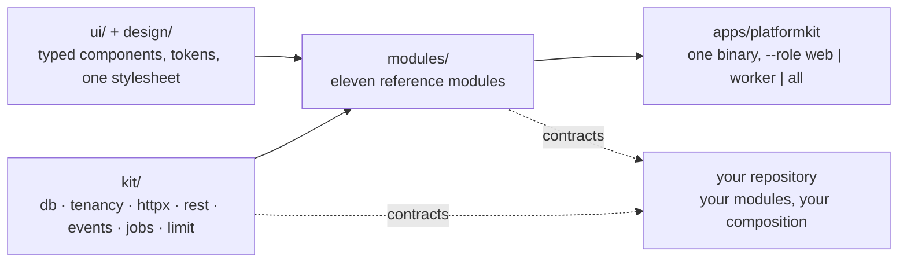

# PlatformKit

**A runnable, open-source reference architecture for multi-tenant SaaS in Go.**
Clone it, run one command, and get tenants, users, sessions and OIDC, roles,
audit, notifications, billing, content, files, a public site and an operator
console — one binary, eleven modules, Postgres row-level security on every
table, and an admin screen generated for every entity.

[](https://github.com/septagon-oss/platformkit/actions/workflows/ci.yml)
[](LICENSE)
[](https://go.dev/dl/)

## Run it

One command on a machine with Docker and Go:

```bash
git clone https://github.com/septagon-oss/platformkit && cd platformkit
scripts/start.sh
```

It brings up Postgres and NATS, writes `config.yaml` from the example,
migrates an empty database, creates the first tenant and its administrator,
prints the administrator's password once, and serves. The five commands it
wraps, for when you want to see each step:

```bash
make up
cp config.example.yaml config.yaml
go run ./apps/platformkit bootstrap --config config.yaml \
    --tenant platformkit --host platformkit.localhost \
    --name PlatformKit --admin-email admin@platformkit.localhost
make run
```

Then open **<http://platformkit.localhost:8080/admin/login>**. Behind it is the
whole application: a dashboard, a screen for every entity mounted through
`rest.Spec`, roles, health, and `/admin/_gallery` for every component it is
drawn with. Every tenant is reached at its own host name, so the `Host` header
is what decides whose data a request sees.

`bootstrap` refuses to run twice, which is what makes it safe to leave in the
binary. The password goes to stderr once, or comes from
`PLATFORMKIT_BOOTSTRAP_PASSWORD`. Ports move with `PLATFORMKIT_PG_PORT` and
`PLATFORMKIT_NATS_PORT`.

## Use the API

Sessions are cookies; the same login serves the browser and `curl`.

```bash
curl -sc jar -H 'Host: platformkit.localhost' -H 'Content-Type: application/json' \
    -d '{"email":"admin@platformkit.localhost","password":"<the printed password>"}' \
    localhost:8080/api/v1/auth/login

curl -sb jar -H 'Host: platformkit.localhost' -H 'Content-Type: application/json' \
    -d '{"title":"chiller-2 supply temperature"}' \
    localhost:8080/api/v1/task/tasks
```

| Route | Purpose | Access |
|---|---|---|
| `/admin`, `/admin/login` | Operator console and sign-in | signed in |
| `/health`, `/ready` | Liveness and readiness; never touch a tenant | public |
| `/api/v1/auth/login`, `/logout`, `/me` | Sessions | public / signed in |
| `/api/v1/auth/password/forgot`, `/reset` | Password reset by mail | public |
| `/api/v1/auth/roles` | A tenant's roles and their permissions | `role:manage` |
| `/api/v1/<module>/<entities>` | Five generated routes per entity: list, get, create, patch, delete | `<module>:read` / `:manage` |
| `/api/v1/content/public/{slug}` | A published page, rendered from Markdown | public |
| `/api/v1/site/settings/public` | The tenant's public site facts | public |
| `/api/v1/file/files` | Streaming uploads under a per-tenant quota | `file:read` / `file:manage` |
| `/api/v1/tenant/tenants`, `/api/v1/billing/plans` | The control plane and the price list | operator tenant only |

Every operation declares exactly one of *public*, *signed in*, or a named
permission, and the application refuses to boot if one does not. A permission
the operator holds (`tenant:manage`, `billing:catalog`) is a class of its own
that a tenant's `*` never expands to. OpenAPI is served at `/openapi.json`
when `server.docs` is on; it is off by default.

## Make it your product

A module is a directory: `contracts/` (the entity, a service interface, its
events and permissions, a fake, and a conformance suite), `internal/`, and a
`module.go` that takes a struct of typed dependencies and returns a manifest.
`apps/platformkit/modules.go` is the whole wiring graph — a list, in dependency
order, that the compiler checks. A dependency you forgot is a compile error on
the line that forgot it, not a nil at boot.

```go
task.Module(task.Deps{Tenants: tenants}),
```

The `task` module is the exemplar: about six hundred lines for an entity with a
lifecycle, three commands, five generated routes, a periodic sweep, six events
and two permissions. Copy its shape; `CONTRIBUTING.md` says what a change looks
like and `ARCHITECTURE.md` says why the kernel is shaped the way it is.

## What is included

- **Tenants** — a control-plane table; every other table carries `tenant_id`
  and `FORCE ROW LEVEL SECURITY`, set per transaction by the kernel.
- **Users and roles** — one row per tenant, argon2id passwords, roles as
  permission lists.
- **Authentication** — hashed server-side sessions, password reset, OIDC with
  PKCE, a limiter shared across replicas.
- **Audit** — every event of every module, with the acting user, under a
  retention job.
- **Notifications** — in-app records plus mail through one SMTP sender.
- **Billing** — plans owned by the operator, a subscription per tenant, monthly
  and yearly renewal with idempotent dunning.
- **Content** — pages and posts with a sanitized public render.
- **Files** — streamed uploads, downloads served as attachments unless
  render-safe, quotas, orphan
  reconciliation.
- **Site** — the tenant's public settings and navigation.
- **Tasks** — the exemplar module.
- **Admin** — the operator console, generated from entity schemas.

Underneath: `kit/db` (phantom-typed tenant and system transactions),
`kit/events` (a transactional outbox relayed to JetStream; events are the job
queue), `kit/jobs`, `kit/limit`, `kit/rest` (an entity's five routes and its
admin screens from one declaration), and `ui/` (typed components and a
stylesheet emitted by Go — no Node, no Tailwind build).

## Verify before shipping

```bash
make check   # build, vet, gofmt, tests against real Postgres and NATS, and the size, package, tenancy and import gates
make e2e     # a fresh database, a bootstrap, and a browser through the admin
```

Ten gates, all run on every pull request and on every tag; the tag also builds
`ghcr.io/septagon-oss/platformkit`, attaches an SBOM and publishes the release.
`loc-budget.json` holds the size ceilings and they only ratchet down: the
kernel is about eight thousand lines and stays under its number.

## Boundaries and expectations

- Postgres and NATS are the only stores. There is no SQLite profile.
- Extension code is Go. Schemas are structs compiled into the binary; there is
  no runtime collection builder.
- A module never imports another module's `internal/` or manifest, only its
  `contracts/`. A script refuses the rest.
- The admin is an operator surface generated from schemas, not a page builder.
  A screen needing custom interaction is hand-written beside the generated one.
- Money moves through a `PaymentProvider` interface; the built-in provider
  records charges and moves nothing. A real processor lives outside this
  repository.
- Version 1 is what `v1.0.0` promises; the ceilings are part of the promise.
  [CHANGELOG.md](CHANGELOG.md) says what changed, and the 0.x scaffolder that
  used to live at this module path is kept under the `legacy-0.x` branch.

## How the pieces fit



The earlier `pk-ui`, `tw`, `pk-styleengine` and `pk-design` foundations were
folded into `ui/` and `design/`; a downstream product composes the public
modules with its own through the same `Deps` structs and pins this module by
tag. [ADR 0009](docs/adr/0009-what-is-public.md) says what is public and what
is not.

## Project links

- [Architecture](ARCHITECTURE.md) and the [decision records](docs/adr)
- [Changelog](CHANGELOG.md)
- [Contributing](CONTRIBUTING.md)
- [Security policy](SECURITY.md)
- [Release procedure](RELEASE.md)
- [Discussions](https://github.com/septagon-oss/platformkit/discussions)
- [Apache-2.0 license](LICENSE)
