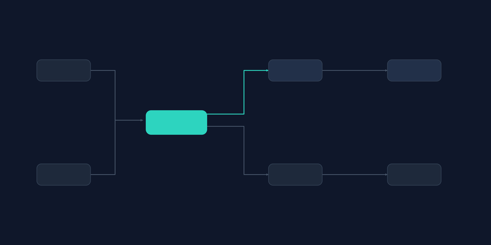
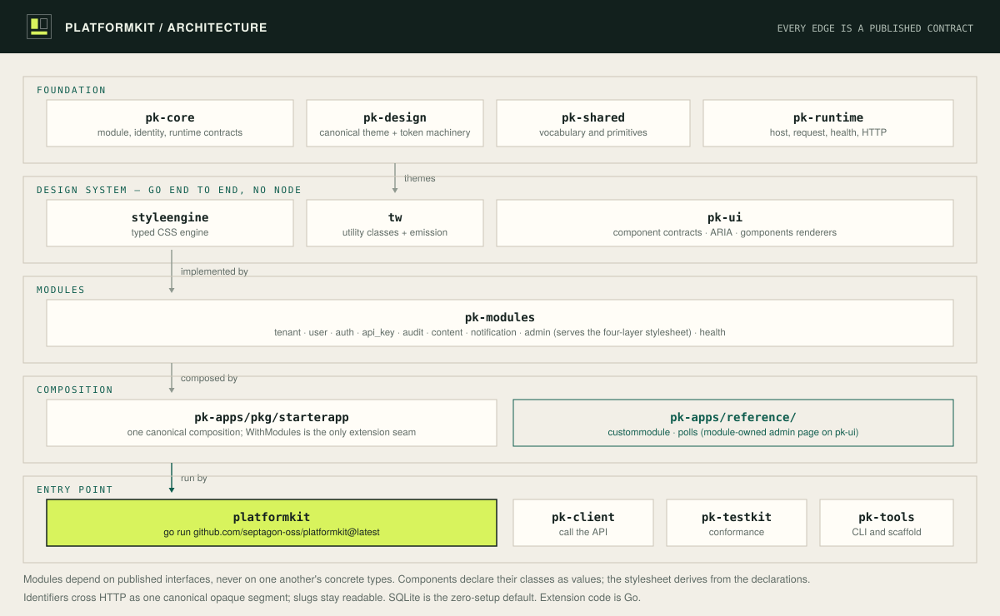

# PlatformKit

**An open-source Go backend for multi-tenant SaaS.** Clone it, run `go run .`, and you get a seeded multi-tenant app — tenants, users, auth, an admin UI, audit, API keys, content, and notifications — composed from nine modules. Pure Go: no CGO, no npm, no Docker, no external database.

It is the part of a SaaS backend you would otherwise rebuild from scratch in every project.



[](https://github.com/septagon-oss/platformkit)
[](LICENSE)
[](https://go.dev/dl/)

---

## Quickstart

```bash
git clone https://github.com/septagon-oss/platformkit
cd platformkit
go run .
```

```
============================================================
 starter-saas — PlatformKit OSS monolith
  listening:    http://localhost:8080
  admin UI:     http://localhost:8080/admin
  health:       http://localhost:8080/healthz
  metrics:      http://localhost:8080/metrics
  default login: admin@local.test / changeme
  modules:      9 composed (admin_management, health_management, tenant_management, user_management, audit_management, auth_management, api_key_management, content_management, notification_management)
============================================================
```

That's it. Open `http://localhost:8080/admin` — note it is an open dashboard with no
login wall today; put it behind your own auth before exposing the port.

The seeded credentials — `admin@local.test` / `changeme`, tenant `tenant_acme` —
authenticate against the auth API (not an admin login screen):

```bash
curl -s -X POST http://localhost:8080/api/v1/auth/sessions \
  -H 'Content-Type: application/json' \
  -d '{"tenant_id":"tenant_acme","email":"admin@local.test","password":"changeme"}'
```

PlatformKit is multi-tenant, so login requires `tenant_id` in the payload.

**Requirements:** Go 1.26+. Nothing else — no CGO, no npm, no Docker, no external
database (SQLite by default). The first build downloads a handful of modules and
takes tens of seconds; subsequent starts take about two seconds.

**Port 8080 busy?** The front door listens on `:8080` and ships no config file. Run the full starter in pk-apps (`pk-apps/apps/starter-saas`, which reads `http.addr` from its `config.yaml`) or change the address in the wrapper's `main.go`.

---

## What you get

Nine modules compose into the running app on the first `go run .`:

- **Tenants** — tenant isolation built into the data layer and the auth flow, not bolted on.
- **Users** — user records scoped to a tenant.
- **Auth & sessions** — a login flow over the auth API (`POST /api/v1/auth/sessions`).
- **API keys** — issuance and storage for programmatic access.
- **Audit log** — an append trail of changes.
- **Content** — a content store with entity CRUD.
- **In-app notifications** — a notification store.
- **Admin UI** — an open server-rendered dashboard at `/admin` (no login wall today), with a sidebar and entity links.
- **Health** — `/healthz` reports the status of the modules that own a data store.

`/healthz` reports seven data/session checks; `admin` and `health` are composed
modules without SQLite stores. `GET /healthz` returns `200` with each of those
seven reporting `healthy` on a fresh database.

---

## What this is NOT

Read this before you file an issue saying we oversold it. We agree with you in advance.

- **Not a no-code tool.** It is a Go codebase. You write Go to extend it.
- **Not a Rails or Django replacement.** It is a backend substrate for multi-tenant
  SaaS, not a full-stack web framework with an ORM, a router opinion, and a generator
  for everything. If you want batteries-included web MVC, this is not that.
- **Not production-hardened at scale on the default store.** SQLite is the zero-setup
  local default so the first run needs no database. It is great for development and
  small deployments. For production at scale, swap in your own store behind the store
  port — that is exactly what the port boundary is for.
- **Not a framework you must adopt wholesale.** Modules compose; take the ones you
  want, ignore the rest, or add your own alongside them.
- **Early. v0.1.0 — our first public release; expect APIs to move.** Verified on
  Linux/x86_64, Go 1.26, `modernc.org/sqlite v1.50.1`, fresh database. Things will
  move. Pin a commit if you need stability today.

---

## How it fits together

The core defines the rules — the contracts, the kernel, the wiring. Modules add
capabilities behind those rules — tenants, users, auth, and the rest. Clients compose
the modules they want into a running application.

Modules never import each other's implementations. They depend only on interfaces —
ports like `AdminRegistrar` and `HealthRegistrar`, or a provider's published contract
such as `audit.AuditEmitter`. Dependency injection supplies the concrete type at
startup. So you can replace one module's implementation without the change cascading
through the others, and you add your own module the same way the nine built-ins are added.



---

## The repositories

PlatformKit is an independently versioned, independently consumable set of layers.
A consumer depends on `pk-core` without pulling the rest. This front-door repo is a
thin `main` wrapping `pk-apps/pkg/starterapp`; the first `go run .` downloads the
PlatformKit modules it needs by version from the Go module proxy. There are no
`replace` directives — `go.work` is local-dev-only.

| Repository | Purpose |
|---|---|
| `pk-core` | The composable core: contracts and kernel that define the module rules. |
| `pk-shared` | Cross-repo vocabulary — shared types used across layers. |
| `pk-runtime` | The host: request handling, health, and HTTP primitives. |
| `pk-design` | Design tokens, themes, and component contracts. |
| `pk-client` | Public client primitives. |
| `pk-tools` | The `pk` CLI — `doctor`, `verify`, `explain`; a scaffold generator lives in `pk-tools/pkg/scaffold` as a library (not a `pk` subcommand). |
| `pk-modules` | The reference module pack — the nine modules above and more. |
| `pk-apps` | Runnable example compositions, including the starter. |
| `pk-testkit` | Conformance and flow testing. |
| `pk-docs` | Public documentation source. |

---

## Open core

PlatformKit is Apache-2.0, and the thing you clone and run is the whole substrate,
not a trial slice: all the public contracts and ports, the default providers that make
it run with zero setup (SQLite, in-memory, stdlib, file-based), the security baseline,
the reference admin UI, the starter app, the `pk` CLI, and the nine-module essentials
pack. That is enough to build and run a multi-tenant SaaS backend on your own
infrastructure. Pro adds hosted and cloud-scale providers, enterprise identity, and a
hosted control plane — implementations that plug in behind the same interfaces.
**The boundary is drawn at the provider, never at the contract: every public interface
a module exposes stays in OSS, and the contracts you build against today do not move
out of open source.** See [docs/open-core.md](docs/open-core.md).

---

## Docs · Contributing · Security · License · Community

- **Docs:** [docs/](docs/)
- **Contributing:** [CONTRIBUTING.md](CONTRIBUTING.md)
- **Security:** [SECURITY.md](SECURITY.md)
- **License:** [Apache-2.0](LICENSE)
- **Community:** [GitHub Discussions](https://github.com/septagon-oss/platformkit/discussions)
